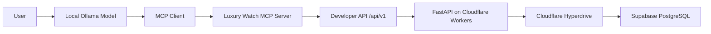

# Luxury Watch MCP Integration

-   Additional **MCP layer** to the existing Luxury Watch API Integration project.
-   The MCP server connects to the existing authenticated Luxury Watch REST API.
-   The integration uses the existing FastAPI backend running on Cloudflare Workers.
-   Market data is retrieved from Supabase PostgreSQL through Cloudflare Hyperdrive.
-   API credentials are provided through environment variables and are not stored in the repository.
-   Main project: [https://github.com/dcanguven/luxury-watch-api-integration](https://github.com/dcanguven/luxury-watch-api-integration)

## Architecture

## MCP Tools

- `list_brands`
- `list_models`
- `search_watches`
- `get_watch`

## Tech Stack

